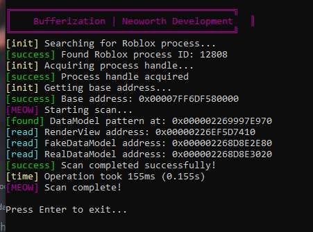

# Roblox Datamodel Dumper

The Roblox DataModel Dumper analyzes process memory to locate and extract critical engine structures through pattern scanning and pointer validation. It identifies the RobloxPlayerBeta process, scans memory regions for specific byte patterns, and follows pointer chains to resolve DataModel addresses. The tool performs multiple safety checks including memory range validation and read permissions to ensure reliable operation without disrupting the target process.

Built with Rust for memory safety and low-level control, the tool interacts directly with Windows system APIs for process memory access. It focuses on educational research of game engine internals, implementing careful memory validation at each step to maintain system stability. The scanning methodology prioritizes precision through incremental verification of memory structures and error handling for clean failure states.